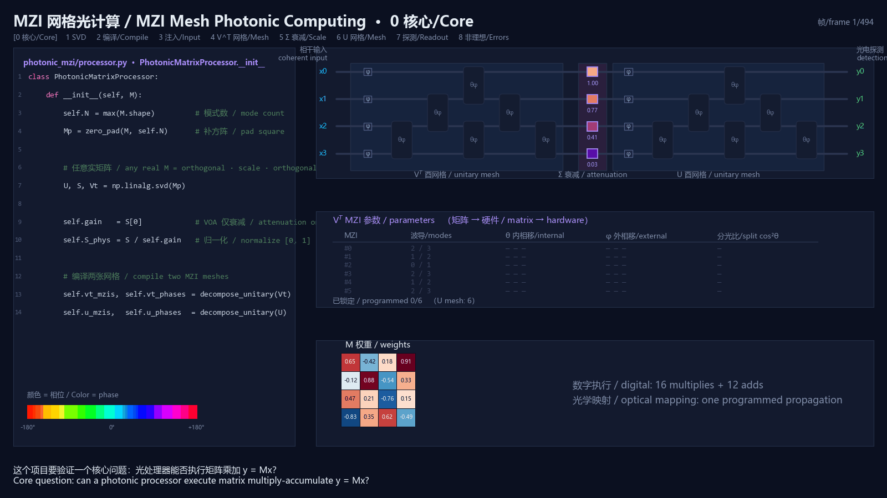
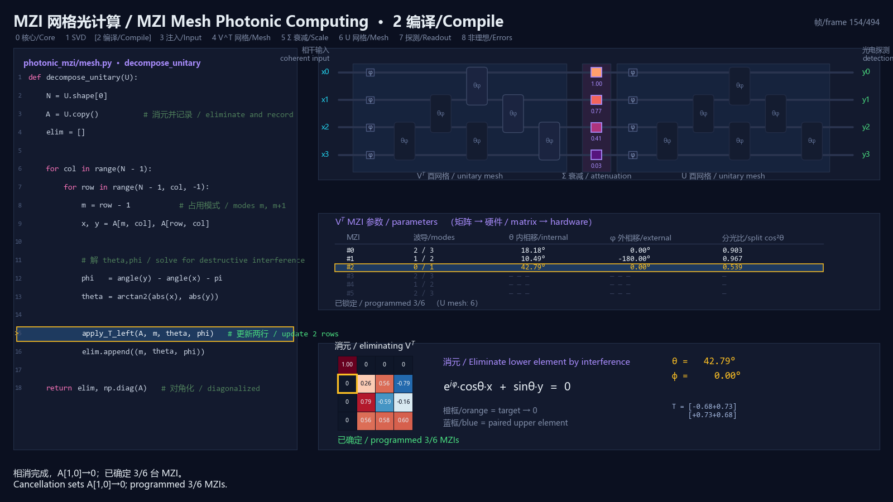
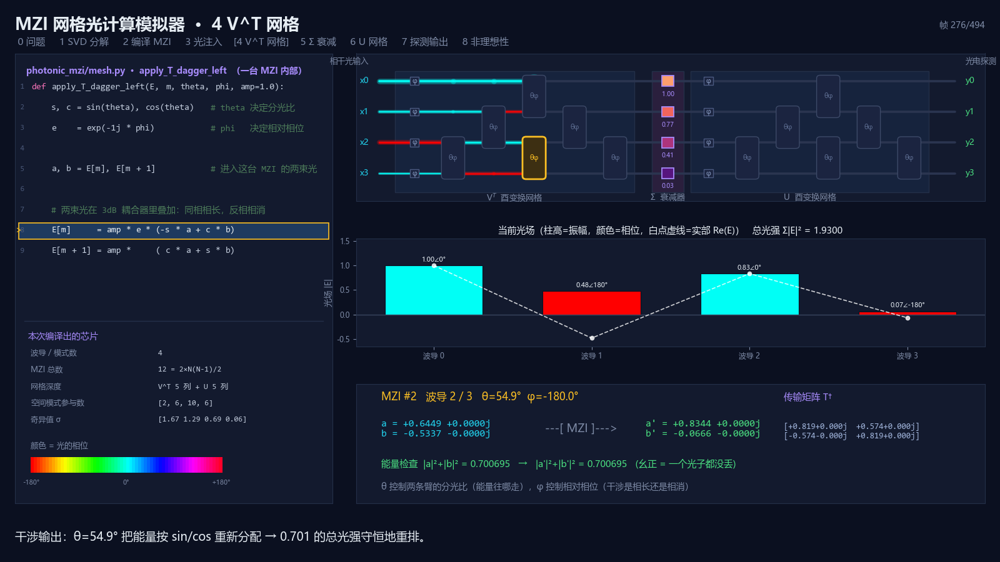
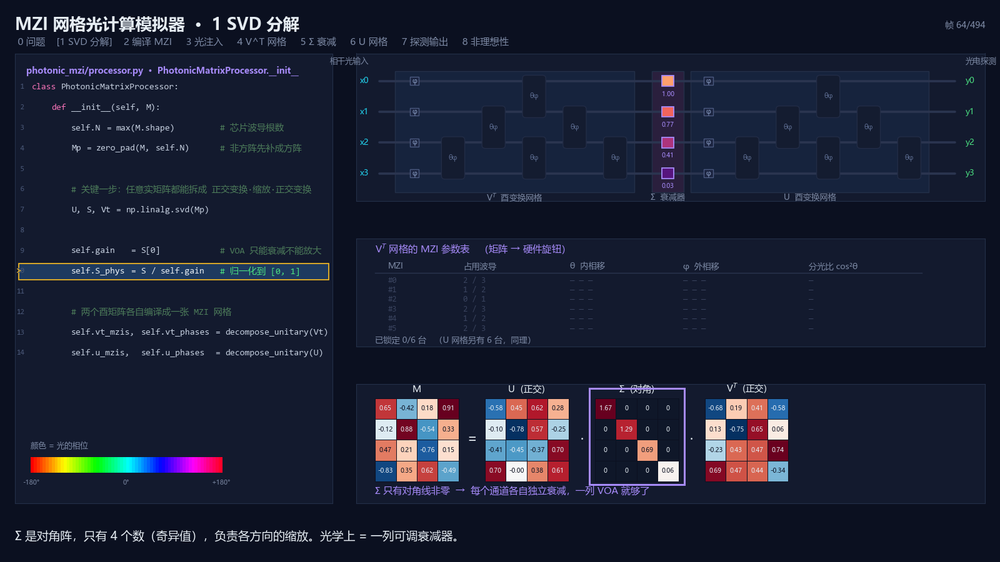
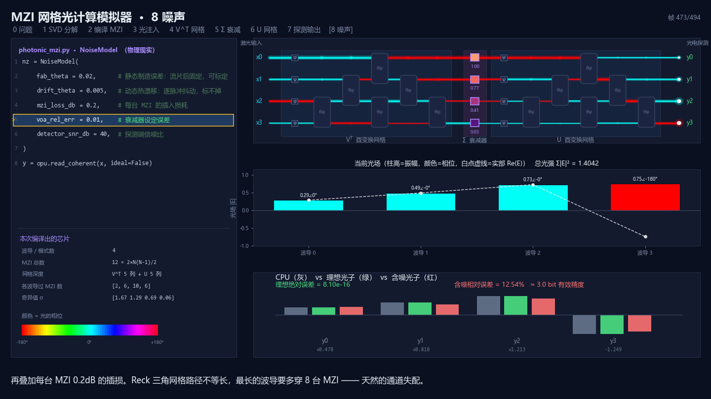

<div align="center">

# photonic-mzi

[English](README.md) | [简体中文](README.zh-CN.md)

**验证光处理器执行矩阵乘加的电路级可行性 —— 把任意实矩阵编译成 MZI 网格，并让光学传播完成线性变换**

[](https://github.com/yaoniming3k/photonic-mzi/actions/workflows/ci.yml)
[](https://www.python.org/downloads/)
[](LICENSE)

本项目的核心目标是验证一件事：**光处理器能否执行矩阵乘加**。它用 SVD、酉变换、
MZI 干涉网格和光学衰减器，把 `y = Mx`（批量时为 `Y = MX`）建立成一条可运行、
可逐器件检查、可与 NumPy 对照的完整计算链，并附逐行代码与逐器件光传播教学动画。

```
输入 [x] ──▶ [ Vᵀ 酉变换 MZI 网格 ] ──▶ [ Σ 光衰减器 ] ──▶ [ U 酉变换 MZI 网格 ] ──▶ [y] 探测器
```

</div>

---

## 核心验证

矩阵乘加并不是在光路里逐条执行电子指令；每个输出元素所需的乘法与求和，被映射为
复振幅编码、干涉叠加、通道缩放和相干读出。本项目验证四个环节能够闭合：

1. **编译可行**：任意实矩阵可经 SVD 拆成两个正交变换和一组非负缩放，并编译为两张 MZI 网格与一列 VOA。
2. **传播可行**：输入向量编码为相干光复振幅后，理想光场传播满足 `E = (M @ x) / gain`；批量输入满足同样关系。
3. **读出可行**：带本振的相干探测恢复带符号输出，数值结果与 `M @ x` 在浮点误差内一致。
4. **误差可评估**：静态相移偏置、动态相位抖动、插损、VOA 误差和等效读出噪声可分别注入并量化影响。

因此，这里验证的是**数学映射、软件实现和简化线性光学电路模型内的可行性**。
它不单独证明真实芯片已经达到某个能耗、延迟、精度、规模或量产指标。

---

## 这个动画在讲什么

<div align="center">

</div>

屏幕**左边是正在执行的代码**（高亮当前行），**右边是这一行在光子芯片上物理发生了什么**。
颜色统一编码光的相位（红 0°、青 180°），柱高是振幅 —— 所以「负数怎么用光表示」
「这台干涉仪是相长还是相消」，看颜色就知道。

```bash
pip install ".[viz]"
python -m photonic_mzi
```

| 键 | 作用 |
|:--:|---|
| `空格` | 暂停 / 继续 |
| `←` `→` | **单步回退 / 前进**（暂停时最有用） |
| `,` `.` | 跳到上一 / 下一阶段 |
| `r` | 从头重播 |

整个流程拆成 9 个阶段：

| 阶段 | 内容 |
|---|---|
| 0 核心问题 | 光处理器能否执行矩阵乘加 `y = M x` |
| 1 SVD 分解 | `M = U · Σ · Vᵀ`，为什么任意实矩阵都存在「正交变换→缩放→正交变换」分解 |
| 2 编译 MZI | 逐个元素消元，看 θ/φ 参数表怎么一行行填满、芯片上的 MZI 怎么一台台点亮 |
| 3 光注入 | 输入向量怎么编码成复振幅（负数 = 相位差 π） |
| 4 Vᵀ 网格 | 光波前逐列推进，每台 MZI 内部的 `a,b → a',b'` 干涉过程 + 能量守恒检查 |
| 5 Σ 衰减 | 理想模型中有意设置的衰减级，奇异值的物理化身 |
| 6 U 网格 | 同上 |
| 7 探测输出 | 与 CPU 对答案，误差 `8.1e-16` |
| 8 非理想性 | 加上静态相移偏置、独立动态抖动、插损和等效读出噪声后的敏感度 |

<table>
<tr>
<td width="50%"><br><sub><b>阶段 2</b>：矩阵消元 ↔ MZI 参数表同步填充</sub></td>
<td width="50%"><br><sub><b>阶段 4</b>：单台 MZI 的干涉与能量守恒</sub></td>
</tr>
<tr>
<td width="50%"><br><sub><b>阶段 1</b>：M = U · Σ · Vᵀ</sub></td>
<td width="50%"><br><sub><b>阶段 8</b>：CPU / 理想光子 / 简化非理想模型三方对比</sub></td>
</tr>
</table>

---

## 安装

```bash
pip install ".[viz]"
```

只用计算内核、不需要动画的话，`pip install .` 即可（仅依赖 numpy）。

开发用可编辑安装（**需要 pip ≥ 21.3**，纯 `pyproject.toml` 项目的可编辑安装依赖 PEP 660）：

```bash
python -m pip install --upgrade pip && pip install -e ".[dev]"
```

也可以完全不安装，直接从源码目录跑 —— `examples/` 和 `pytest` 都自带了
`src/` 的路径处理：

```bash
PYTHONPATH=src python -m photonic_mzi
```

## 用法

```python
import numpy as np
from photonic_mzi import PhotonicMatrixProcessor

M = np.random.randn(8, 5)          # 非方阵也可以
opu = PhotonicMatrixProcessor(M, seed=42)

x = np.random.randn(5)
opu.read_coherent(x)               # 与 M @ x 一致到 ~1e-15
opu.read_coherent(np.random.randn(5, 256))   # 批量输入

E = opu.optical_field(x)           # 探测前物理复光场；理想时为 (M @ x) / opu.gain

print(opu.report())                # MZI 数、网格深度、损耗上界代理、回环误差
```

加上简化非理想性，并演示「静态相移控制偏置能表征、独立动态抖动不能靠静态校准消除」：

```python
from photonic_mzi import NoiseModel

nz = NoiseModel(
    fab_theta=0.02,        # 固定相移控制偏置；理想表征模型可校准
    drift_theta=0.005,     # 每个输入样本独立的相位抖动（i.i.d. 简化）
    mzi_loss_db=0.2,       # 每台 MZI 插损
    voa_rel_err=0.01,
    detector_snr_db=40,    # 探测后等效相对 AWGN，不是散粒/TIA 细节模型
)
opu = PhotonicMatrixProcessor(M, noise=nz, seed=7)

opu.read_coherent(x, ideal=False)  # 未校准
opu.calibrate()                    # 出厂表征，抵消静态误差
opu.read_coherent(x, ideal=False)  # 校准后
```

两个读出接口对应两种真实的探测方案：

| 方法 | 物理含义 |
|---|---|
| `read_coherent(x)` | 相干（零差）探测，需要本振光提供相位参考，能拿到**带符号**的实部 |
| `read_intensity(x)` | 平方律直接探测后再加读出噪声，返回标定后的 `gain²·\|E\|²`，**符号信息丢失** |

## 示例

```bash
python examples/01_hello_photonic.py        # 最小可运行示例
python examples/02_noise_and_calibration.py # 静态相移偏置与独立动态抖动
python examples/03_neural_layer.py          # 拿光子芯片跑一层神经网络推理
```

`02` 的实测结果，说明为什么必须把两类误差分开建模：

| 简化模型构成 | 未校准 | 校准后 |
|---|---:|---:|
| 只有静态相移控制偏置 (fab 0.02 rad) | 4.2 bit | **48.0 bit**¹ |
| 只有独立动态相位抖动 (drift 0.02 rad) | 3.9 bit | 3.9 bit |
| 两者都有 (fab 0.02 + drift 0.005) | 4.2 bit | 5.9 bit |

¹ 48 bit 只表示“已知加性偏置被其精确负值抵消”的数值结果，不能外推成真实分束器
制造误差或真实芯片的可校准精度。

`03` 的实测结果，只说明这个类别间隔较大的合成任务在一定噪声下仍能保持分类结果：

| 独立相位抖动 (rad) | logit 相对误差 | 有效 bit | 分类准确率 |
|---:|---:|---:|---:|
| 0.01 | 2.01% | 5.6 | 1.000 |
| 0.05 | 10.49% | 3.3 | 1.000 |
| 0.10 | 22.76% | 2.1 | 1.000 |
| 0.20 | 50.68% | 1.0 | 0.925 |
| 0.40 | 86.28% | 0.2 | 0.383 |

这里每个 batch 列都有独立抖动。该任务是类别间隔较大的合成数据，结果不能外推到
其他模型、真实数据集或具有时间相关性的热漂移。

## 测试

```bash
pytest -m "not slow"
```

128 项快速用例，约 3 秒。完整套件共 133 项（含逐帧字形扫描与 GIF 导出）。

测试覆盖：退化 / 结构化矩阵、随机稠密、非方阵、批量、能量守恒、
噪声语义（固定偏置、每样本独立抖动、固定 VOA 误差）、光场/探测分层、校准边界、
严格输入校验，以及退化和结构化矩阵边界。

```bash
python benchmarks/bench_decomposition.py
```

---

## 已知限制

- 用的是 **Reck 三角网格**，不是 Clements 矩形网格。两者 MZI 数量相同（`N(N-1)/2`），
  但 Clements 光学深度更低且通常对均匀损耗更稳健；当前版本尚未实现。
- `fab_*` 只表示加性相移控制偏置，不表示会限制可达分光比的分束器制造偏差；
  `calibrate()` 也不补偿 VOA 误差或插损。
- `drift_*` 是每输入样本独立的相位抖动，不描述真实热漂移的时间相关、空间相关和串扰。
- `detector_snr_db` 是探测后的等效 AWGN；没有散粒噪声、本振、响应度和带宽模型。
- `mode_mzi_count()` 只是空间模式参与器件数，报告中的损耗是串联上界估计，
  不是端到端光路追踪。
- 前向传播仍是 Python 里逐台 MZI 循环。同一列的 MZI 天然可并行，向量化后还能再快一个量级。
- 没有建模输入调制器、激光功率、DAC/ADC、系统能耗/延迟、波长相关性、偏振、
  非线性和器件间串扰。因此不能用本项目定量预测商用芯片性能。

## 参考

更完整的模型边界与验证方法见 [技术验证说明](docs/validation.zh-CN.md)。

- Reck et al., *Experimental realization of any discrete unitary operator*, PRL 73, 58 (1994)
- Clements et al., *Optimal design for universal multiport interferometers*, Optica 3, 1460 (2016)
- Shen et al., *Deep learning with coherent nanophotonic circuits*, Nature Photonics 11, 441 (2017)

## License

[MIT](LICENSE)
